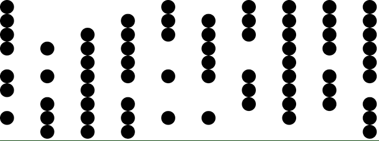

# Finally! The Game of Life

A Game of Life adaption using React!

## Available Scripts

In the project directory, just run:
    
    yarn install
    yarn start (react-scripts start)
    
, and open [http://localhost:3000](http://localhost:3000) to view the app in your browser.
    
Additional commands:

    yarn build (react-scripts build)
    yarn test (react-scripts test)
    yarn eject (react-scripts eject)

## References

How did I create the app?

    npx create-react-app game-of-life
    
## Side note

I'm sure the methods `gameOfLife` and `aliveNeighbors` need some refactoring, *but fuck it!*, it works :smirking_face: